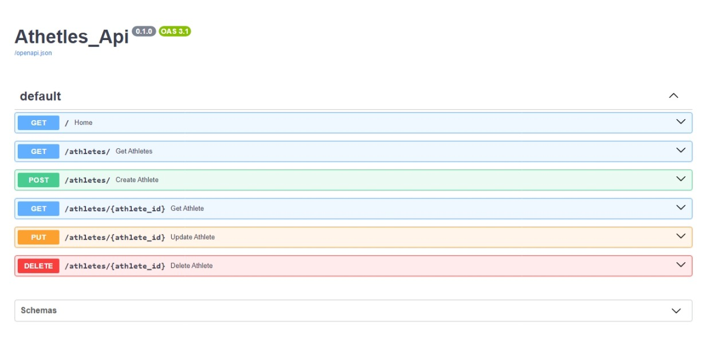

## Athetles_Api
  
### Sobre o projeto

Este projeto é uma API desenvolvida em Python utilizando o framework FastAPI e o banco de dados SQLite3. A API permite realizar uma variedade de operações CRUD (Create, Read, Update, Delete) para gerenciar informações detalhadas sobre atletas. Com essa API, os usuários têm a capacidade de criar, visualizar, atualizar e excluir registros de atletas de forma eficiente e intuitiva.

 
 
 

### Funcionalidades:

- **Criar**: Adicionar novos registros de atletas com suas informações pessoais.
- **Consultar**: Obter detalhes sobre os atletas cadastrados, como nome, idade, peso, altura e outras informações.
- **Atualizar**: Modificar as informações dos atletas existentes, como peso, altura e outras características.
- **Deletar**: Remover registros de atletas da base de dados.

### Objetivos:

- Demonstração do uso do framework `FastAPI` para criar APIs RESTful de forma rápida e eficiente.
- Integração de um banco de dados SQLite3 em uma aplicação Python utilizando o módulo `sqlite3`.
- Apresentação de boas práticas de desenvolvimento de APIs, incluindo a utilização de modelos de dados (usando Pydantic) e tratamento de erros.

### Resultado:
  

